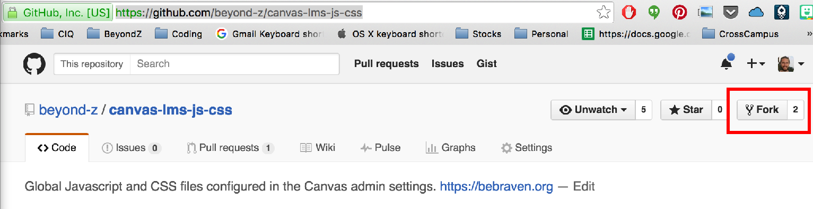

# canvas-lms-js-css
Global Javascript and CSS files configured in the Canvas admin settings.

See [Adding custom javascript and CSS](https://guides.instructure.com/m/4214/l/41896-how-do-i-add-custom-javascript-and-css-files-to-my-account) for more info

# Making changes
Generally, we use a standar git pull request workflow that is outlined
nicely [here](http://nathanhoad.net/git-workflow-forks-remotes-and-pull-requests)

## Initial one time setup
1. Fork the [canvas-lms-js-css](https://github.com/beyond-z/canvas-lms-js-css) repository into your own account using the fork button:
  1.  
2. Clone your forked repository to your local machine: ```git clone https://github.com/<your_username>/canvas-lms-js-css.git```
3. Now you can see all your code in the ```canvas-lms-js-css```
   directory
3. Add the upstream remote so you can keep your code in sync with the
   beyondz-code: ```git remote add upstream https://github.com/beyondz-z/canvas-lms-js-css```

## Ongoing changes
1. Always start by getting your local code and your forked code on
   github up to date with the upstream beyond-z repository code:
```Shell
git checkout staging;
git pull upstream staging;
git push origin staging;
```
2. Now create a branch to work on your project / changes in: ```git checkout -b <branch_name>```
3. Make your changes, add your files to the local index, and commit
   them:
```Shell
git add <your_files>
git commit -m "A nice message describing the change"
```
4. Push your changes to your fork on github: ```git push origin <branch_name>```
5. Login to gihub and open the pull request against ```beyond-z/staging```
  * Make sure and give the pull request a nice title and description
6. Once your pull request has been merged, you can delete your branch:
```Shell
git checkout staging;
git pull upstream staging;
git branch -d <branch_name>;
git push origin staging;
```
